# GitHub Actions Analysis Report

**Generated:** 2025-08-22T11:33:58+01:00
**Config Path:** /Users/nicholas/Projects/pipeline-analyzer/examples/complex-webapp/.github/workflows

## 📊 Overview

- **Workflow files:** 1
- **Total jobs:** 3  
- **Total steps:** 16

## 📊 Workflow Overview

```mermaid
flowchart TD
    TEST_FRONTEND["`**test-frontend**
Runner: ubuntu-latest
• npm ci
• npm run lint
• npm run test:coverage
`"]
    TEST_BACKEND["`**test-backend**
Runner: ubuntu-latest
• pip install -r api/requirements.txt
• pip install -r api/requirements-dev.txt
• cd api
• ... (1 more)
`"]
    BUILD_AND_DEPLOY["`**build-and-deploy**
Runner: ubuntu-latest
• npm ci
• npm run build:prod
• docker build -t webapp-frontend:${{ g...
• ... (2 more)
`"]
    TEST_FRONTEND --> TEST_BACKEND
    TEST_BACKEND --> BUILD_AND_DEPLOY

    classDef workflow fill:#e1f5fe,stroke:#01579b,stroke-width:3px
    classDef setup fill:#f3e5f5,stroke:#4a148c,stroke-width:2px
    classDef test fill:#e8f5e8,stroke:#1b5e20,stroke-width:2px
    classDef build fill:#fff3e0,stroke:#e65100,stroke-width:2px
    classDef deploy fill:#e0f2f1,stroke:#004d40,stroke-width:2px
    classDef utility fill:#f1f8e9,stroke:#33691e,stroke-width:2px
    class TEST_FRONTEND test
    class TEST_BACKEND test
    class BUILD_AND_DEPLOY build
```

## 🚀 Quick Start for go-task Migration

1. **[🔄 go-task Migration Guide](summaries/go-task-migration.md)** - Convert workflows to go-task
2. **[🛠️ Actions Usage](summaries/actions-usage.md)** - Actions used across workflows
3. **[⚡ Commands Analysis](summaries/commands-analysis.md)** - Commands that could become tasks

## 📁 Directory Structure

### Workflows
Individual workflow analysis:

- [workflows/CI-CD-Pipeline.md](workflows/CI-CD-Pipeline.md) - CI/CD Pipeline

### Jobs
Individual job analysis with go-task conversion opportunities:

- [jobs/build-and-deploy.md](jobs/build-and-deploy.md) - build-and-deploy
- [jobs/test-backend.md](jobs/test-backend.md) - test-backend
- [jobs/test-frontend.md](jobs/test-frontend.md) - test-frontend

### Analysis Summaries

- [🔄 go-task Migration Guide](summaries/go-task-migration.md) - **Start here for build refactoring**
- [🛠️ Actions Usage](summaries/actions-usage.md) - GitHub Actions used
- [🏃 Runners Analysis](summaries/runners-analysis.md) - Runner usage patterns  
- [⚡ Commands Analysis](summaries/commands-analysis.md) - Commands suitable for go-task

## 🎯 Build Refactoring Recommendations

- 📦 Multiple npm commands detected - consider consolidating into go-task
- 🐳 Docker commands found - go-task could simplify container management
- 💡 Consider creating go-task equivalents for repeated command patterns

## 🔧 Most Used Actions

| Action | Usage Count |
|--------|-------------|
| actions/checkout@v4 | 3 |
| actions/setup-node@v4 | 2 |
| codecov/codecov-action@v4 | 1 |
| actions/setup-python@v4 | 1 |

## 🔍 Next Steps for CI/CD Refactoring

1. **Review [go-task Migration Guide](summaries/go-task-migration.md)** for refactoring strategy
2. **Identify commands** that can be moved to go-task from [Commands Analysis](summaries/commands-analysis.md)
3. **Create Taskfile.yml** with extracted commands for local execution
4. **Update workflows** to call `task <task-name>` instead of direct commands
5. **Test locally** by running tasks before pushing to CI

This approach makes your builds **portable, testable locally, and CI-agnostic**.
