# Go-Task Analysis Report

**Generated:** 2025-08-22T11:41:24+01:00
**Taskfile:** /Users/nicholas/Projects/pipeline-analyzer/examples/complex-webapp/Taskfile.yml

## 📊 Overview

- **Tasks:** 23
- **Includes:** 1
- **Circular Dependencies:** None ✅
- **Critical Path Length:** 7 tasks
- **Tasks with Caching:** 3/23 (13.0%)

## 📊 Workflow Overview

```mermaid
flowchart TD
    INSTALL_FRONTEND["`**install-frontend**
Install frontend dependencies
• npm install
`"]
    TEST["`**test**
Run all tests
`"]
    BUILD["`**build**
Build all components
`"]
    CLEAN["`**clean**
Clean all build artifacts
• rm -rf dist/
• rm -rf node_modules/
• rm -rf api/dist/
• ... (2 more)
`"]
    DEV["`**dev**
Start development environment
• docker-compose up -d postgres redis
• npm run start &
• cd api && python manage.py runserver &
• ... (2 more)
`"]
    STOP_SERVICES["`**stop-services**
Stop all services
• docker-compose down
`"]
    INSTALL_BACKEND["`**install-backend**
Install backend dependencies
• pip install -r api/requirements.txt
• pip install -r api/requirements-dev.txt
`"]

    classDef workflow fill:#e1f5fe,stroke:#01579b,stroke-width:3px
    classDef setup fill:#f3e5f5,stroke:#4a148c,stroke-width:2px
    classDef test fill:#e8f5e8,stroke:#1b5e20,stroke-width:2px
    classDef build fill:#fff3e0,stroke:#e65100,stroke-width:2px
    classDef deploy fill:#e0f2f1,stroke:#004d40,stroke-width:2px
    classDef utility fill:#f1f8e9,stroke:#33691e,stroke-width:2px
    class INSTALL_FRONTEND setup
    class TEST test
    class BUILD build
    class CLEAN setup
    class DEV utility
    class STOP_SERVICES utility
    class INSTALL_BACKEND setup
```

## 🚀 Quick Start

1. **[📋 Optimization Guide](optimization-guide.md)** - Performance improvement recommendations
2. **[📈 Task Usage Analysis](summaries/task-usage.md)** - Task dependency patterns
3. **[⚡ Command Analysis](summaries/commands.md)** - Command patterns and tools
4. **[🔗 Dependency Graph](tasks/dependency-graph.md)** - Visual task relationships

## 📁 Directory Structure

### Tasks
Individual task analysis with commands and optimization opportunities:

- [tasks/build.md](tasks/build.md)
- [tasks/build-backend.md](tasks/build-backend.md)
- [tasks/build-docker.md](tasks/build-docker.md)
- [tasks/build-frontend.md](tasks/build-frontend.md)
- [tasks/clean.md](tasks/clean.md)
- [tasks/deploy-prod.md](tasks/deploy-prod.md)
- [tasks/deploy-staging.md](tasks/deploy-staging.md)
- [tasks/dev.md](tasks/dev.md)
- [tasks/install.md](tasks/install.md)
- [tasks/install-backend.md](tasks/install-backend.md)
- [tasks/install-frontend.md](tasks/install-frontend.md)
- [tasks/lint.md](tasks/lint.md)
- [tasks/lint-backend.md](tasks/lint-backend.md)
- [tasks/lint-frontend.md](tasks/lint-frontend.md)
- [tasks/performance-test.md](tasks/performance-test.md)
- [tasks/security-scan.md](tasks/security-scan.md)
- [tasks/start-services.md](tasks/start-services.md)
- [tasks/stop-services.md](tasks/stop-services.md)
- [tasks/test.md](tasks/test.md)
- [tasks/test-backend.md](tasks/test-backend.md)
- [tasks/test-e2e.md](tasks/test-e2e.md)
- [tasks/test-frontend.md](tasks/test-frontend.md)
- [tasks/test-integration.md](tasks/test-integration.md)

### Includes
Analysis of included Taskfiles:

- [includes/testing.md](includes/testing.md)

### Analysis Summaries

- [📈 Task Usage & Dependencies](summaries/task-usage.md)
- [📝 All Tasks Index](summaries/all-tasks.md)
- [⚡ Command Analysis](summaries/commands.md)
- [📊 Performance Metrics](summaries/performance.md)
- [🔍 Variable Analysis](summaries/variables.md)
- [📁 Include Analysis](summaries/includes.md)

## 🔍 Key Insights

### Most Depended-On Tasks

| Task | Used By | Link |
|------|---------|------|
| install-frontend | 4 tasks | [View](tasks/install-frontend.md) |
| build-docker | 4 tasks | [View](tasks/build-docker.md) |
| install-backend | 4 tasks | [View](tasks/install-backend.md) |
| build | 2 tasks | [View](tasks/build.md) |
| install | 2 tasks | [View](tasks/install.md) |

### Top Optimization Opportunities

- ⚠️ **test-e2e**: Task could benefit from caching optimization
- ⚠️ **deploy-staging**: Task could benefit from caching optimization
- ⚠️ **test-integration**: Task could benefit from caching optimization

### Primary Tool Ecosystem: **Docker**

## 🎯 Next Steps

1. **Review [Optimization Guide](optimization-guide.md)** for specific improvements
2. **Check [Performance Metrics](summaries/performance.md)** for caching opportunities
3. **Examine [Dependency Graph](tasks/dependency-graph.md)** for parallelization potential

