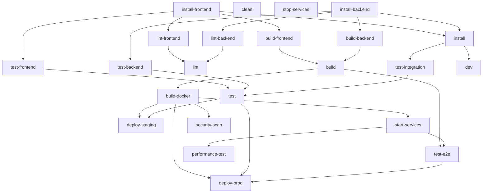

# Task Dependency Graph

**Generated:** 2025-08-21T10:18:49+01:00

## 🔗 Dependency Overview

- **Total tasks:** 23
- **Tasks with dependencies:** 23
- **Circular dependencies:** 0

## 📊 Dependency Visualization



## 🎯 Critical Path

The longest dependency chain in your tasks:

```
deploy-prod → test-e2e → start-services → build-docker → build → build-backend → install-backend
```

**Length:** 7 tasks

Optimizing tasks in the critical path will have the biggest impact on overall execution time.

## 📊 Task Levels

Tasks grouped by their dependency depth:

**Level 1** (can run in parallel):
- [clean](clean.md)
- [install-backend](install-backend.md)
- [install-frontend](install-frontend.md)
- [stop-services](stop-services.md)

**Level 2** (can run in parallel):
- [build-backend](build-backend.md)
- [build-frontend](build-frontend.md)
- [install](install.md)
- [lint-backend](lint-backend.md)
- [lint-frontend](lint-frontend.md)
- [test-backend](test-backend.md)
- [test-frontend](test-frontend.md)

**Level 3** (can run in parallel):
- [build](build.md)
- [dev](dev.md)
- [lint](lint.md)
- [test-integration](test-integration.md)

**Level 4** (can run in parallel):
- [build-docker](build-docker.md)
- [test](test.md)

**Level 5** (can run in parallel):
- [deploy-staging](deploy-staging.md)
- [security-scan](security-scan.md)
- [start-services](start-services.md)

**Level 6** (can run in parallel):
- [performance-test](performance-test.md)
- [test-e2e](test-e2e.md)

**Level 7** (can run in parallel):
- [deploy-prod](deploy-prod.md)

## Navigation

- [← Back to Overview](../README.md)
- [Task Usage Analysis](../summaries/task-usage.md)
- [Optimization Guide](../optimization-guide.md)
